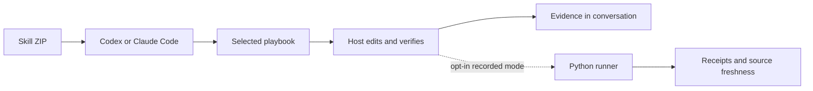

# jstack

[한국어](README.md) · [English](README.en.md)

**Checkable outcomes. Deliberate effort. Your coding agent.**

[](https://github.com/promptprobe/jstack/actions/workflows/validate.yml)
[](LICENSE)
[](https://github.com/promptprobe/jstack/releases/download/v0.2.0/jstack-mode.zip)

jstack is a portable coding skill for **Codex and Claude Code**. Download one
folder, place it in your host's skills directory, and invoke it. Choose an effort
level, follow a focused playbook, verify the result, and report the evidence.

**No Python, Git clone, setup command or config file is needed for the skill.**
Your project's tests still need their own runtime and dependencies. One entry
skill and eight playbooks are included. Host model usage still applies.

Version **0.2.0** defaults to skill-only operation. A separate Python runner is
optional for persisted receipts, retry enforcement and source freshness checks.
See [validation](docs/validation.md) for observed behavior and its limits.

```text
You:   $jstack-mode cheap — fix the duplicate cart item after reconnect.
Agent: Define one-click acceptance → reproduce → fix → verify → report evidence.
You:   Also cover reconnecting twice.
Agent: Continue the same jstack session and budget.
You:   jstack off
Agent: Stop applying the mode in this conversation.
```

In Claude Code, use `/jstack-mode` instead of `$jstack-mode`.

## Download and use

1. **[Download jstack-mode.zip](https://github.com/promptprobe/jstack/releases/download/v0.2.0/jstack-mode.zip)** and extract it.
2. Copy the whole **`jstack-mode` folder**, including references, to one location below.
3. Invoke the skill. Refresh/restart your host if discovery does not update.

| Host | Personal, all projects | Project only | Invoke |
| --- | --- | --- | --- |
| Codex | `~/.agents/skills/jstack-mode/` | `.agents/skills/jstack-mode/` | `$jstack-mode cheap` |
| Claude Code | `~/.claude/skills/jstack-mode/` | `.claude/skills/jstack-mode/` | `/jstack-mode cheap` |

Choose personal or project scope. Create missing directories; the final path must
end in `skills/jstack-mode/SKILL.md`. For both hosts copy the same folder to both
locations. Back up any edited existing skill before replacing it. Do not copy only
SKILL.md: its referenced playbooks are part of the skill.

```text
$jstack-mode normal
Reproduce and fix the login bug, then verify it with the project's real checks.
```

Use `/jstack-mode` in Claude Code. **That's all the setup required.** No `doctor`,
`.jstack/`, generated config, instruction-file changes or session IDs are needed.
The agent discovers real checks from your project. Missing or unavailable tests
are reported as gaps, not passes. Invoke once per conversation, again in a new one.

Paths follow [OpenAI](https://learn.chatgpt.com/docs/build-skills) and
[Claude Code](https://code.claude.com/docs/en/skills) documentation.
[Skill source](skills/jstack-mode) · [SHA-256 checksum](https://github.com/promptprobe/jstack/releases/download/v0.2.0/SHA256SUMS) · [Installation details](docs/installation.md)

### Optional recorded operation

| Capability | Skill-only, default | Optional runner |
| --- | --- | --- |
| Routing, budget, sticky conversation | Agent instructions | Supported |
| Project checks and evidence | Native host tools, conversation report | Persisted command receipts |
| Config and session IDs | Not required | Required |
| Retry limits and stale results | Agent adherence | Per-task gates and Git fingerprints |
| Additional requirements | None for jstack itself | Python 3.10+ and Git |

An existing `.jstack/config.json` may supply preferences and check commands; it is
not a prerequisite. Follow [optional runner setup](docs/installation.md#optional-recorded-operation)
only if you want recorded checks. Installing the runner does not select it:
request **“Use jstack recorded mode”** explicitly. See [configuration](docs/configuration.md).

## Pick the effort, keep the evidence

| Budget | Investigation passes¹ | Repair attempts² | Maximum children³ | Initial file-read hint¹ |
| --- | ---: | ---: | ---: | ---: |
| `cheap` | 1 | 1 | 0 | 4 |
| `normal` | 2 | 2 | 1 | 10 |
| `deep` | 4 | 3 | 3 | 20 |

¹ Guidance for the agent, not a technical limit on host tools.

² Guidance in skill-only mode; the optional runner enforces the initial final check plus these retries per task.

³ Use any lower configured ceiling. Fanout is **disabled by default** and needs explicit user/config enablement and host permission.

These are limits, not work to fill. `cheap` reduces exploration and coordination;
it does not skip required checks. `deep` permits more investigation without forcing
extra agents. The current host model stays selected. There is no automatic budget
upgrade, model shopping, or duplicated multi-model review panel.

jstack does not meter host tokens, enforce dollar caps, or claim a measured savings
percentage. Even `cheap` preserves the host's model and reasoning effort; it cannot
shrink context from other installed plugins. Its cost hypothesis is simple: load fewer instructions, inspect focused
source slices, reuse evidence, and stop unproductive retries. Measure actual
cost and task quality in your environment. [Cost-control philosophy →](docs/cost-control.md)

## Workflows that fit the task

| Playbook | Starting question | Useful evidence |
| --- | --- | --- |
| `feature` | What complete user path changes? | Behavior and its relevant failure case |
| `bug-fix` | Can we reproduce the wrong result? | Failing reproduction, then passing regression |
| `refactor` | What behavior must remain invariant? | Same characterization checks before and after |
| `perf` | Which metric is slow under which workload? | Comparable measurements and correctness checks |
| `prototype` | What uncertainty should this answer? | A bounded experiment and its limits |
| `verification` | Which exact claim or artifact is under test? | Direct observations and uncovered conditions |
| `shipping` | What is authorized, and what revision is delivered? | Remote SHA, CI, and live evidence separately |
| `lightweight` | What small reversible effect do we need? | Direct inspection or an existing check |

Only the relevant playbook is loaded. The CLI includes a deliberately simple
English/Korean keyword router; the agent should correct ambiguous routing with
`--playbook`. Routing never executes shipping actions.

Examples for Codex (replace `$` with `/` in Claude Code):

```text
$jstack-mode normal — Add CSV export. The downloaded file must reopen with
the same row count and Unicode names.

$jstack-mode cheap — Correct the empty-state label and inspect it at mobile width.

$jstack-mode deep — Reduce search latency using the same dataset and repeated
measurements. Keep ranking results unchanged.

$jstack-mode normal — Verify this PR without changing application code.
Report coverage gaps and check the actual saved artifact.
```

### Sticky means this conversation

Skill-only mode carries the active flag and budget in conversation context, with
no session files. Say `jstack off` to stop or `jstack budget cheap` to change effort.
Reinvoke in a new conversation. There is no global activation or background hook.
The host must retain this state through compaction; if lost, reinvoke the skill.
Sticky behavior is an instruction contract, not guaranteed persistence. Optional
recorded mode additionally retains an explicit session ID; the file alone cannot
make the host remember it.

## Optional local helper, without an agent

After installing and configuring the optional runner, use it directly:

```sh
python3 .jstack/jstack.py mode on --host codex --budget cheap
# Copy the returned session ID into the next command.

python3 .jstack/jstack.py plan 'Fix reconnect duplication' --session SESSION_ID \
  --playbook bug-fix --accept 'One click adds one item after reconnect'
# Copy the returned task ID. Configure checks before creating the plan.

python3 .jstack/jstack.py verify --task TASK_ID --phase baseline
# Make the change. A failed baseline is useful reproduction evidence.

python3 .jstack/jstack.py verify --task TASK_ID
python3 .jstack/jstack.py report --task TASK_ID
python3 .jstack/jstack.py report --task TASK_ID --format json
```

A receipt contains the exact argv, exit code, duration, bounded output tail, and
source fingerprints before and after. Reports become stale when Git-visible
content changes. The latest failed final run cannot be hidden by an older pass.
An empty check list, missing executable, timeout, or source mutation during a check
cannot produce `local_checks_passed`.

Runtime observations and remote facts can be recorded with `evidence`. They are
clearly marked **operator-supplied**, rather than promoted to independently checked
facts. Natural-language acceptance is not machine-evaluated. Local receipts are
mutable files, not signed attestations. [CLI and evidence reference →](docs/cli.md)

## Architecture



```text
skills/jstack-mode/       Portable entry and on-demand playbooks
adapters/                Codex and Claude Code host guidance
jstack_core/             Config, setup, routing, session state, checks, reports
jstack.py                Checkout and installed entry point
tests/                   Filesystem, workflow, evidence and CLI regressions
scripts/                 Skill ZIP builder, validation and smoke test
docs/                    Install, architecture, cost policy and reference
```

The host owns reasoning, editing and optional agent creation. The helper owns
local contracts and receipts; it never invokes a model, deploys, commits, or pushes.
No runtime dependency on pstack or Cursor. [Architecture and boundaries →](docs/architecture.md)

## Validate and contribute

```sh
python3 scripts/validate.py
```

Validation runs unit/integration tests, the installed CLI smoke flow, Python syntax
checks, self-contained skill archive and host-layout checks, and local documentation-link checks. CI covers
Linux, macOS and Windows across selected Python versions. A passing CI badge is
evidence for tooling tests, not live Codex/Claude behavior or token savings.

See the [release validation record](docs/validation.md) for observed results,
including live Codex skill discovery. See [CONTRIBUTING.md](CONTRIBUTING.md) for
focused changes and behavioral scenarios.
For security-sensitive reports, see [SECURITY.md](SECURITY.md).

## Current limits and roadmap

- **Host evaluation:** a three-turn live Codex fixture passed activation, follow-up
  continuity and opt-out. Broader tasks, compaction and live Claude Code evaluation
  remain open; the result does not establish equivalent behavior across hosts.
- **Cost evidence:** add opt-in host usage import and compare cost *and* correctness
  on the same tasks. Actual spend caps need host support.
- **Verification inputs:** fingerprint ignored dependencies and selected external
  inputs explicitly; add adapters for CI and browser artifacts. Today those require
  separate observations, and submodules yield unknown freshness.
- **Distribution:** add signed release checksums and host-native plugin packaging
  alongside the portable skill ZIP and unsigned SHA-256 checksum already available. No npm or PyPI package is published.
- **Routing:** evaluate ambiguous and multilingual requests against a public fixture
  set. Keep explicit overrides and avoid adding a model call merely to select a playbook.

See the [roadmap](docs/roadmap.md) for acceptance criteria.

## Inspiration and license

[pstack](https://github.com/cursor/plugins/tree/main/pstack), created by Lauren Tan
([poteto](https://github.com/poteto)), informed the idea of a persistent engineering
mode with task-specific playbooks and evidence-led work. jstack is independently
implemented: its code, prompts, structure, budget policy and documentation were
written for this project. It is not a fork or an official pstack integration.

pstack also has configurable reasoning budgets; jstack does not claim to invent
that concept or to have proven lower costs. See [design provenance](docs/provenance.md).

[MIT](LICENSE) © 2026 promptprobe.
