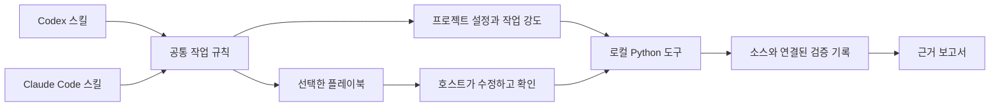

# jstack

**필요한 만큼 탐색하고, 실제 결과로 검증하는 AI 코딩 워크플로.**

[한국어](README.md) · [English](README.en.md)

[](https://github.com/promptprobe/jstack/actions/workflows/validate.yml)
[](LICENSE)
[](https://www.python.org/downloads/)

jstack은 **Codex와 Claude Code에서 사용하는 AI 코딩 워크플로 도구**입니다. 대화에서 한 번 활성화한 뒤 원하는 결과와 작업 강도를 정하면, 에이전트가 작업에 맞는 절차를 따릅니다. 함께 설치되는 로컬 도구는 완료 기준을 기록하고, 검증 명령을 실행하고, 확인된 사실과 아직 모르는 부분을 구분해 보여줍니다.

진입 스킬 하나, 작업별 플레이북 여덟 개로 구성됩니다. Python 외부 패키지가 필요 없고, 로컬 도구 자체는 모델 API를 호출하거나 사용 정보를 전송하지 않습니다. Codex·Claude Code에서 에이전트를 실행할 때의 모델 사용량은 별도로 발생합니다.

현재 **0.1.0 초기 버전**입니다. Codex에서 버그 수정·후속 요청의 모드 유지·모드 해제를 실제 3턴으로 확인했습니다. 도구 테스트와 실사용 시험의 범위 및 한계는 [검증 기록](docs/validation.ko.md)에 구분해 적었습니다.

```text
사용자: $jstack-mode cheap
        재연결 후 장바구니 상품이 중복으로 추가되는 버그를 고쳐줘.

에이전트: 완료 기준 설정 → 버그 재현 → 수정 → 검증 → 근거 보고

사용자: 두 번 연속 재연결하는 경우도 확인해줘.

에이전트: 같은 jstack 세션과 작업 강도를 유지하며 후속 작업 진행

사용자: jstack off

에이전트: 이 대화에서 jstack 모드 해제
```

Claude Code에서는 `$jstack-mode` 대신 **`/jstack-mode`**를 사용합니다. 위 대화는 사용 예시이며, 모든 모델이 항상 동일한 순서로 행동한다는 보장은 아닙니다.

<a id="install-in-a-project"></a>

## 설치

**Python 3.10 이상**, **Git**, 프로젝트 스킬을 지원하는 Codex 또는 Claude Code가 필요합니다. 적용할 Git 저장소의 최상위 폴더에서 설치하세요.

```sh
git clone https://github.com/promptprobe/jstack.git "$HOME/.local/share/jstack"
cd /path/to/your/project

# 어떤 파일을 설치·수정하는지 먼저 확인
python3 "$HOME/.local/share/jstack/jstack.py" setup --host both --dry-run

# Codex와 Claude Code에 함께 설치
python3 "$HOME/.local/share/jstack/jstack.py" setup --host both
```

| 사용할 도구 | 설치 옵션 | 스킬 설치 위치 | 대화에서 호출 |
| --- | --- | --- | --- |
| Codex CLI / IDE | `--host codex` | `.agents/skills/jstack-mode/` | `$jstack-mode` |
| Claude Code | `--host claude` | `.claude/skills/jstack-mode/` | `/jstack-mode` |
| 둘 다 | `--host both` | 위 두 위치 | 각 도구의 호출 방식 사용 |

설치 도구는 다음을 처리합니다.

- `.jstack/`에 실행 도구와 프로젝트 설정을 복사합니다.
- 필요한 `AGENTS.md`, `CLAUDE.md`, `.gitignore`에 jstack 전용 구역을 추가합니다.
- 기존 지침과 설정을 보존합니다. 사용자가 수정한 관리 대상 파일은 임의로 덮어쓰지 않습니다.

설치만으로 모드가 켜지거나 전역 설정이 바뀌지는 않습니다. 스킬이 목록에 나타나지 않으면 호스트를 새로고침하거나 재시작하세요. 전역 명령을 설치하지 않으므로 Java에 포함된 별개의 `jstack` 명령과도 충돌하지 않습니다.

팀과 공유하려면 설치된 스킬, 실행 도구, 설정, 설치 명세와 프로젝트 지침을 커밋하세요. 작업 내용과 명령 출력이 저장되는 **`.jstack/local/`은 Git에서 제외**해야 합니다. [설치·업데이트·삭제 안내](docs/installation.md)

### 프로젝트에 맞는 검증 명령 설정

기본 설정에는 검증 명령이 없습니다. 프로젝트마다 실행 방법이 다르므로 임의의 테스트 명령을 가정하지 않습니다. **검증 항목이 비어 있으면 통과로 처리하지 않습니다.**

Python 프로젝트라면 `.jstack/config.json`을 다음처럼 설정할 수 있습니다.

```json
{
  "version": 1,
  "budget": "normal",
  "agents": { "enabled": false, "max_children": 1 },
  "verification": {
    "timeout_seconds": 120,
    "checks": [
      {
        "name": "tests",
        "argv": ["{python}", "-m", "unittest", "discover", "-s", "tests"],
        "required": true
      }
    ]
  }
}
```

실제로 해당 프로젝트를 검증하는 명령으로 바꿔주세요. [Python·Node 설정 예시](examples)도 제공됩니다.

명령은 문자열 배열인 `argv`로 지정하며, 프로젝트 최상위 폴더에서 실행됩니다. 셸 치환은 자동으로 수행하지 않습니다. `{python}`은 jstack을 실행 중인 Python 경로로 바뀝니다. Windows에서는 `.cmd` 래퍼에 의존하기보다 실행 파일이나 스크립트의 인터프리터를 명시하는 방식을 권장합니다.

```sh
python3 .jstack/jstack.py doctor
```

`doctor`는 설치 파일과 설정을 점검합니다. 모델을 호출하거나 호스트의 스킬 인식까지 증명하는 명령은 아닙니다. 검증 명령은 프로젝트 코드를 실제로 실행하므로, 처음 보는 저장소에서는 설정과 실행할 스크립트를 먼저 확인하세요. [설정 상세](docs/configuration.md)

## 작업 강도: cheap · normal · deep

| 단계 | 탐색 횟수 지침¹ | 첫 검증 후 수정·재시도² | 하위 에이전트 상한³ | 처음 읽을 파일 수 지침¹ |
| --- | ---: | ---: | ---: | ---: |
| `cheap` | 1 | 1 | 0 | 4 |
| `normal` | 2 | 2 | 1 | 10 |
| `deep` | 4 | 3 | 3 | 20 |

¹ 에이전트에게 주는 지침입니다. 호스트의 도구 호출을 기술적으로 제한하지는 않습니다.

² 로컬 검증 도구는 작업별로 최초 최종 검증 1회와 해당 횟수만큼의 재시도를 허용합니다.

³ 프로젝트 설정의 상한도 함께 적용됩니다. 병렬 에이전트 사용은 **기본적으로 꺼져 있습니다.**

표의 숫자는 채워야 할 할당량이 아니라 상한입니다. `cheap`에서는 탐색과 조율을 줄이되 필수 검증을 생략하지 않습니다. `deep`에서는 더 깊이 조사할 수 있지만, 여러 에이전트를 반드시 띄우지는 않습니다. 현재 호스트의 모델을 유지하며 작업 강도나 유료 모델을 자동으로 올리지 않습니다.

**토큰·금액을 측정하거나 청구액 상한을 강제하는 기능은 아직 없습니다.** `cheap`도 호스트의 모델·추론 강도나 다른 플러그인의 문맥 크기를 자동으로 바꾸지 않습니다. 필요한 지침만 읽고, 변경과 관련된 파일을 살펴보고, 불필요한 반복을 줄여 비용을 낮추는 것이 설계 목표입니다. 실제 절감률은 비교 측정 전이므로 주장하지 않습니다. [비용 관리 원칙](docs/cost-control.md)

## 작업별 플레이북

| 플레이북 | 사용하는 상황 | 확인할 근거 |
| --- | --- | --- |
| `feature` | 새로운 기능 추가 | 사용 흐름과 관련 실패 사례의 실제 동작 |
| `bug-fix` | 버그 수정 | 수정 전 실패 재현과 수정 후 회귀 테스트 |
| `refactor` | 동작을 유지하면서 구조 개선 | 변경 전후 동일한 동작을 확인하는 검사 |
| `perf` | 성능 개선 | 동일 조건의 측정값과 기능 정상 여부 |
| `prototype` | 아이디어·가설 검토 | 제한된 실험 결과와 실제 사용을 위한 남은 작업 |
| `verification` | 변경·산출물 검증 | 직접 확인한 사실과 확인하지 못한 조건 |
| `shipping` | 승인된 공개·배포 작업 | 원격 커밋, CI, 실제 배포 상태를 각각 확인 |
| `lightweight` | 문구·간격 등 작은 수정 | 수정된 결과 확인 또는 관련 기존 검사 |

해당 작업의 플레이북만 읽도록 설계했습니다. CLI의 자동 분류는 간단한 한국어·영어 키워드 방식이라 문맥을 오해할 수 있습니다. 에이전트는 작업 의도를 판단하고 필요하면 `--playbook`으로 바로잡아야 합니다. 플레이북 선택만으로 공개·배포 명령이 실행되지는 않습니다.

Codex 사용 예시입니다. Claude Code에서는 `$`를 `/`로 바꿔 사용하세요.

```text
$jstack-mode normal
CSV 내보내기를 추가해줘. 내려받은 파일을 다시 열었을 때
행 수와 한글 이름이 그대로 유지돼야 해.

$jstack-mode cheap
빈 화면 안내 문구를 수정하고 모바일 너비에서도 확인해줘.

$jstack-mode deep
같은 데이터로 반복 측정하면서 검색 지연을 줄여줘.
검색 결과의 순서는 유지해야 해.

$jstack-mode normal
코드는 수정하지 말고 이 PR을 검증해줘.
저장된 결과물을 확인하고 검증하지 못한 부분도 알려줘.
```

### 한 번 켜면 언제까지 유지되나요?

**같은 대화 안에서 유지하도록 설계했습니다.** 활성화할 때 생성된 세션 ID와 작업 강도를 에이전트가 다음 요청에도 이어 사용합니다. 대화별 기록은 분리되므로 다른 대화의 모드가 자동으로 켜지지 않습니다.

- `jstack off`: 현재 대화의 모드 해제
- `jstack budget cheap`: 현재 세션의 작업 강도 변경
- CLI의 작업별 `--budget`: 해당 작업에만 적용하며 세션 기본값은 유지

상시 실행되는 서비스나 전역 활성 세션은 없습니다. 대화가 요약되거나 문맥이 사라질 때 세션 ID를 유지하는지는 호스트의 동작에 달려 있습니다. ID를 잃으면 스킬을 다시 호출하거나 기존 ID를 알려줘야 합니다. 따라서 sticky 모드는 **대화 지침과 세션 기록의 조합이며, 호스트 차원의 영구 기억 보장은 아닙니다.**

## 에이전트 없이 직접 실행하기

로컬 도구의 기능은 명령으로도 사용할 수 있습니다.

```sh
python3 .jstack/jstack.py mode on --host codex --budget cheap
# 출력된 세션 ID를 아래 SESSION_ID에 입력

python3 .jstack/jstack.py plan '재연결 후 상품 중복 추가 버그 수정' \
  --session SESSION_ID --playbook bug-fix \
  --accept '재연결 후 한 번 클릭하면 상품이 하나만 추가된다'
# 작업 생성 전에 검증 명령을 설정하고, 출력된 작업 ID를 아래 TASK_ID에 입력

python3 .jstack/jstack.py verify --task TASK_ID --phase baseline
# 수정 전 실패는 재현 근거가 됩니다. 이후 코드를 수정합니다.

python3 .jstack/jstack.py verify --task TASK_ID
python3 .jstack/jstack.py report --task TASK_ID
python3 .jstack/jstack.py report --task TASK_ID --format json
```

검증 기록에는 실행 명령, 종료 코드, 소요 시간, 출력의 마지막 부분, 실행 전후 소스의 식별값이 남습니다. 검증 이후 Git이 추적하거나 무시하지 않은 파일이 달라지면 이전 결과를 **오래된 결과**로 표시합니다. 최신 검증이 실패했는데 과거의 성공 기록으로 통과했다고 보여주지 않습니다.

검증 항목이 없거나, 실행 파일을 찾지 못하거나, 제한 시간이 지나거나, 검사 도중 소스가 바뀌면 `local_checks_passed`로 처리하지 않습니다. 다만 이 상태도 해당 명령의 검사 범위를 통과했다는 뜻이며, 기능 전체의 완성이나 배포 성공을 자동으로 뜻하지는 않습니다.

실행 화면, CI, 배포 결과 등 추가 근거는 `evidence`로 기록할 수 있습니다. 직접 입력한 주장은 **사용자가 제공한 관찰**로 구분하며, 도구가 독립적으로 검증한 사실로 바꾸지 않습니다. 자연어 완료 기준은 자동 판정하지 않고, 로컬 JSON 기록은 서명된 증명서가 아닙니다. [명령·근거 기록 상세](docs/cli.md)

## 구조



```text
skills/jstack-mode/       공통 진입 스킬과 작업별 플레이북
adapters/                Codex·Claude Code별 안내
jstack_core/             설정, 설치, 작업 분류, 세션, 검증, 보고
jstack.py                실행 진입점
tests/                   설치·상태·검증 관련 회귀 테스트
scripts/                 자동 검증과 격리된 전체 흐름 테스트
docs/                    설치, 구조, 비용 원칙, 상세 문서
```

호스트는 판단·코드 수정·필요한 에이전트 실행을 담당합니다. 로컬 도구는 작업 규칙과 검증 기록을 담당하며, 직접 모델을 호출하거나 배포·커밋·푸시하지 않습니다. pstack이나 Cursor에 대한 실행 의존성도 없습니다. [구조와 검증 범위](docs/architecture.md)

## 테스트와 기여

```sh
python3 scripts/validate.py
```

단위·통합 테스트, 설치된 CLI의 전체 흐름, Python 문법, 스킬 구조, 문서 내부 링크를 확인합니다. CI는 Linux·macOS·Windows와 여러 Python 버전을 대상으로 실행합니다. **CI 통과는 도구 테스트의 근거이며, 모든 호스트에서의 모델 행동이나 토큰 절감까지 증명하지는 않습니다.**

실제로 확인한 환경과 결과는 [한국어 검증 기록](docs/validation.ko.md)을 참고하세요. 기여 방법과 실제 호스트 평가 시나리오는 [기여 안내](CONTRIBUTING.md), 보안 관련 제보 방법은 [보안 안내](SECURITY.md)에 있습니다. 그 밖의 상세 기술 문서는 현재 영문으로 제공됩니다.

## 현재 한계와 다음 단계

- **실제 호스트 평가:** 버그 수정, 후속 요청, 모드 해제, 대화 요약 후 복구를 반복 검증합니다. 설치 테스트와 실제 모델의 지침 준수 여부는 구분합니다.
- **실제 비용 측정:** 사용자가 선택한 경우 호스트 사용량을 가져와 비용과 결과 품질을 함께 비교합니다. 청구액을 확실히 제한하려면 호스트 지원이 필요합니다.
- **검증 범위 확장:** 현재 식별값은 무시된 파일, 외부 서비스, 환경 변화까지 포괄하지 않습니다. 선택한 외부 입력, CI 결과, 브라우저 산출물을 연결하고 서브모듈 지원도 추가할 예정입니다.
- **배포 편의:** 프로젝트 단위 설치가 안정화되면 호스트별 플러그인 패키징과 서명된 체크섬을 검토합니다. npm·PyPI 패키지는 아직 배포하지 않았습니다.
- **작업 분류 개선:** 문맥이 모호하거나 여러 언어가 섞인 사례로 분류 품질을 평가합니다. 사용자의 명시적 선택을 유지하고, 단순 분류만을 위해 모델 호출을 추가하지 않습니다.

구체적인 완료 기준은 [로드맵](docs/roadmap.md)에 정리했습니다.

## 영감과 라이선스

제가 좋아하는.. Lauren Tan([poteto](https://github.com/poteto))의 [pstack](https://github.com/cursor/plugins/tree/main/pstack)에서 대화에 유지되는 엔지니어링 모드, 작업별 플레이북, 근거 중심의 검증이라는 개념에 영감을 받았습니다.

jstack의 코드, 프롬프트, 구조, 작업 강도 정책과 문서는 이 프로젝트를 위해 독립적으로 작성했습니다. pstack의 포크나 공식 연동 프로젝트는 아닙니다. pstack에도 추론 예산 설정이 있으므로 예산 선택을 jstack만의 발명이라고 주장하지 않으며, 비용이 더 적게 든다는 비교 결과도 아직 없습니다. [설계 출처](docs/provenance.md)

[MIT 라이선스](LICENSE) © 2026 promptprobe.
