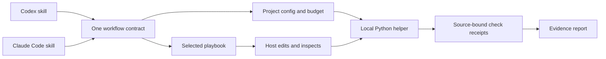

# jstack

**Checkable outcomes. Deliberate effort. Your coding agent.**

[](https://github.com/promptprobe/jstack/actions/workflows/validate.yml)
[](LICENSE)
[](https://www.python.org/downloads/)

jstack is a small workflow toolkit for **Codex and Claude Code**. Turn it on once
in a conversation, describe the outcome you want, and choose how much effort to
spend. The agent follows a focused playbook; a local helper records the acceptance
contract, runs explicit checks, and shows what the evidence actually supports.

One entry skill. Eight playbooks. No Python dependencies, model API calls, telemetry,
or background service. Version **0.1.0** is an early release: the local tooling is
tested, while agent adherence still depends on the host and model.

```text
You:   $jstack-mode cheap — fix the duplicate cart item after reconnect.
Agent: Define one-click acceptance → reproduce → fix → verify → report evidence.
You:   Also cover reconnecting twice.
Agent: Continue the same jstack session and budget.
You:   jstack off
Agent: Stop applying the mode in this conversation.
```

In Claude Code, use `/jstack-mode` instead of `$jstack-mode`.

## Install in a project

You need **Python 3.10+**, **Git**, and a host that supports project skills. Run
setup at the target Git repository root. No package manager or global CLI install
is needed. This avoids replacing the JVM's unrelated `jstack` command.

```sh
git clone https://github.com/promptprobe/jstack.git "$HOME/.local/share/jstack"
cd /path/to/your/project

# Preview the paths that setup will manage.
python3 "$HOME/.local/share/jstack/jstack.py" setup --host both --dry-run

# Install both adapters, or choose just codex or claude.
python3 "$HOME/.local/share/jstack/jstack.py" setup --host both
```

| Target | Setup flag | Installed skill | Invoke |
| --- | --- | --- | --- |
| Codex CLI / IDE | `--host codex` | `.agents/skills/jstack-mode/` | `$jstack-mode` |
| Claude Code | `--host claude` | `.claude/skills/jstack-mode/` | `/jstack-mode` |
| Both | `--host both` | Both locations | Either host |

Setup copies a self-contained runtime into `.jstack/`, creates a project config,
and adds small marked sections to `AGENTS.md`, `CLAUDE.md`, and `.gitignore` as
appropriate. It preserves existing content and refuses to replace locally edited
managed files. Installing does **not** activate the mode or change global settings.
Restart or refresh your host if the new skill does not appear.

Commit the installed skill, runtime, config, manifest and instruction files to
share the setup with your team. Keep `.jstack/local/` ignored: it can contain task
text and captured command output. See [setup details](docs/installation.md).

### Configure a real check

The default check list is empty. jstack cannot infer a trustworthy project test
command and will not mark empty verification as passed. For a Python project,
edit `.jstack/config.json` to include:

```json
{
  "version": 1,
  "budget": "normal",
  "agents": { "enabled": false, "max_children": 1 },
  "verification": {
    "timeout_seconds": 120,
    "checks": [
      {
        "name": "tests",
        "argv": ["{python}", "-m", "unittest", "discover", "-s", "tests"],
        "required": true
      }
    ]
  }
}
```

Use your project's actual command; [examples](examples) cover Python and Node.
Commands are argv arrays, run from the project root without shell interpolation.
`{python}` resolves to the interpreter running jstack. On Windows, invoke script
entry points through their interpreter rather than relying on `.cmd` shell wrappers.
These are executable project commands: inspect the config before running checks
from an unfamiliar repository.

```sh
python3 .jstack/jstack.py doctor
```

`doctor` checks installation integrity and configuration. It does not call an AI
model or prove that a host loaded the skill. [Configuration reference →](docs/configuration.md)

## Pick the effort, keep the evidence

| Budget | Investigation passes¹ | Repair attempts² | Maximum children³ | Initial file-read hint¹ |
| --- | ---: | ---: | ---: | ---: |
| `cheap` | 1 | 1 | 0 | 4 |
| `normal` | 2 | 2 | 1 | 10 |
| `deep` | 4 | 3 | 3 | 20 |

¹ Guidance for the agent, not a technical limit on host tools.

² The runner allows the initial final check plus this many retries per task.

³ Effective ceiling also depends on project config. Fanout is **disabled by default**.

These are limits, not work to fill. `cheap` reduces exploration and coordination;
it does not skip required checks. `deep` permits more investigation without forcing
extra agents. The current host model stays selected. There is no automatic budget
upgrade, model shopping, or duplicated multi-model review panel.

jstack does not meter host tokens, enforce dollar caps, or claim a measured savings
percentage. Its cost hypothesis is simple: load fewer instructions, inspect focused
source slices, reuse evidence, and stop unproductive retries. Measure actual
cost and task quality in your environment. [Cost-control philosophy →](docs/cost-control.md)

## Workflows that fit the task

| Playbook | Starting question | Useful evidence |
| --- | --- | --- |
| `feature` | What complete user path changes? | Behavior and its relevant failure case |
| `bug-fix` | Can we reproduce the wrong result? | Failing reproduction, then passing regression |
| `refactor` | What behavior must remain invariant? | Same characterization checks before and after |
| `perf` | Which metric is slow under which workload? | Comparable measurements and correctness checks |
| `prototype` | What uncertainty should this answer? | A bounded experiment and its limits |
| `verification` | Which exact claim or artifact is under test? | Direct observations and uncovered conditions |
| `shipping` | What is authorized, and what revision is delivered? | Remote SHA, CI, and live evidence separately |
| `lightweight` | What small reversible effect do we need? | Direct inspection or an existing check |

Only the relevant playbook is loaded. The CLI includes a deliberately simple
English/Korean keyword router; the agent should correct ambiguous routing with
`--playbook`. Routing never executes shipping actions.

Examples for Codex (replace `$` with `/` in Claude Code):

```text
$jstack-mode normal — Add CSV export. The downloaded file must reopen with
the same row count and Unicode names.

$jstack-mode cheap — Correct the empty-state label and inspect it at mobile width.

$jstack-mode deep — Reduce search latency using the same dataset and repeated
measurements. Keep ranking results unchanged.

$jstack-mode normal — Verify this PR without changing application code.
Report coverage gaps and check the actual saved artifact.
```

### Sticky means this conversation

The helper returns a session ID; the agent carries that ID and budget into later
turns. Sessions are separate local records, so one conversation cannot silently
turn another one on. Say `jstack off` to opt out, or `jstack budget cheap` to change
the session's effort. A per-task CLI budget override does not change session defaults.

There is no hidden global active session or always-running hook. The host must
follow the skill and carry the ID through compaction. If that context is lost,
reinvoke the skill or provide your session ID. Sticky behavior is an instruction
contract, not guaranteed host persistence.

## The local helper, without an agent

Every deterministic part can be used directly:

```sh
python3 .jstack/jstack.py mode on --host codex --budget cheap
# Copy the returned session ID into the next command.

python3 .jstack/jstack.py plan 'Fix reconnect duplication' --session SESSION_ID \
  --playbook bug-fix --accept 'One click adds one item after reconnect'
# Copy the returned task ID. Configure checks before creating the plan.

python3 .jstack/jstack.py verify --task TASK_ID --phase baseline
# Make the change. A failed baseline is useful reproduction evidence.

python3 .jstack/jstack.py verify --task TASK_ID
python3 .jstack/jstack.py report --task TASK_ID
python3 .jstack/jstack.py report --task TASK_ID --format json
```

A receipt contains the exact argv, exit code, duration, bounded output tail, and
source fingerprints before and after. Reports become stale when Git-visible
content changes. The latest failed final run cannot be hidden by an older pass.
An empty check list, missing executable, timeout, or source mutation during a check
cannot produce `local_checks_passed`.

Runtime observations and remote facts can be recorded with `evidence`. They are
clearly marked **operator-supplied**, rather than promoted to independently checked
facts. Natural-language acceptance is not machine-evaluated. Local receipts are
mutable files, not signed attestations. [CLI and evidence reference →](docs/cli.md)

## Architecture



```text
skills/jstack-mode/       Portable entry and on-demand playbooks
adapters/                Codex and Claude Code host guidance
jstack_core/             Config, setup, routing, session state, checks, reports
jstack.py                Checkout and installed entry point
tests/                   Filesystem, workflow, evidence and CLI regressions
scripts/                 Validation and isolated end-to-end smoke test
docs/                    Install, architecture, cost policy and reference
```

The host owns reasoning, editing and optional agent creation. The helper owns
local contracts and receipts; it never invokes a model, deploys, commits, or pushes.
No runtime dependency on pstack or Cursor. [Architecture and boundaries →](docs/architecture.md)

## Validate and contribute

```sh
python3 scripts/validate.py
```

Validation runs unit/integration tests, the installed CLI smoke flow, Python syntax
checks, skill structure checks, and local documentation-link checks. CI covers
Linux, macOS and Windows across selected Python versions. A passing CI badge is
evidence for tooling tests, not live Codex/Claude behavior or token savings.

See the [release validation record](docs/validation.md) for observed results,
including live Codex skill discovery. See [CONTRIBUTING.md](CONTRIBUTING.md) for
focused changes and behavioral scenarios.
For security-sensitive reports, see [SECURITY.md](SECURITY.md).

## Current limits and roadmap

- **Host evaluation:** run repeatable real Codex and Claude Code tasks, including
  compaction, opt-out, and budget adherence. Adapter installation tests already run;
  this release does not claim equivalent live-host behavior.
- **Cost evidence:** add opt-in host usage import and compare cost *and* correctness
  on the same tasks. Actual spend caps need host support.
- **Verification inputs:** fingerprint ignored dependencies and selected external
  inputs explicitly; add adapters for CI and browser artifacts. Today those require
  separate observations, and submodules yield unknown freshness.
- **Distribution:** add signed release checksums and host-native plugin packaging
  after the project-local flow stabilizes. No npm or PyPI package is published.
- **Routing:** evaluate ambiguous and multilingual requests against a public fixture
  set. Keep explicit overrides and avoid adding a model call merely to select a playbook.

See the [roadmap](docs/roadmap.md) for acceptance criteria.

## Inspiration and license

[pstack](https://github.com/cursor/plugins/tree/main/pstack), created by Lauren Tan
([poteto](https://github.com/poteto)), informed the idea of a persistent engineering
mode with task-specific playbooks and evidence-led work. jstack is independently
implemented: its code, prompts, structure, budget policy and documentation were
written for this project. It is not a fork or an official pstack integration.

pstack also has configurable reasoning budgets; jstack does not claim to invent
that concept or to have proven lower costs. See [design provenance](docs/provenance.md).

[MIT](LICENSE) © 2026 promptprobe.
